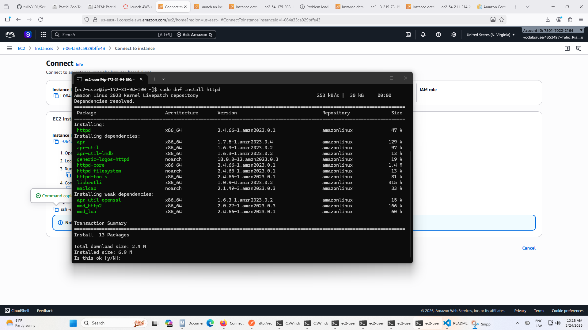

# SecuenciaDePellProxyTDSE
Parcial TDSE

Prueba local Math Service

Prueba local Proxy redirigiendo a instancia de MathService

## Instancias

Creando instancias en AWS

Instalando en EC2 java 17

Pasando .class de MathService a EC2

Desplegue funcional en Ec2 de PellSeq

Despliegue funcional de la segunda Ec2 de PellSeq

Probando desde Postman la peticion directamente hacia la instancia

## Proxy Server

Despliegue del proxy server en una instancia de EC2 y prueba desde postamn

## Apache Server

Al entrar a nuestra instancia de EC2, donde desarrollaremos el formulario, donde el usuario ingresará el valor y se calculara la secuencia respectiva de pell, instalamos primero apache

