# SecuenciaDePellProxyTDSE
Parcial TDSE

[Video Explicativo](https://youtu.be/y-r88GxWzJg)

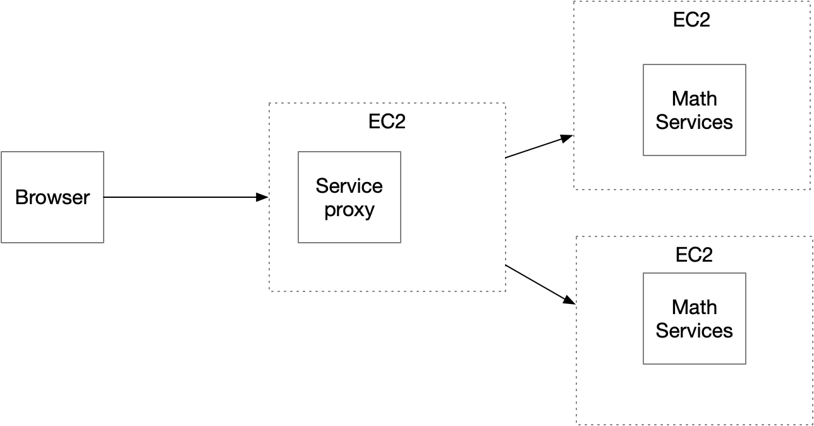

Mediante esta arquitectura de microservicios, donde tendremos tres instancias de ec2 con diferentes propositos, sea el proxy un mediador o balanceador de carga, dado el caso de que alguna de los MathServices este caído, redirija al otro.

## MathService

Estas instancias van a tener una Api desarrollada en SpringBoot que van a calcular la secuencia de pell, de manera recursiva y devolveran una lista con cada uno de sus valores desde P(0) hasta p(N), para todo valor mayor a 2.

- Controlador:

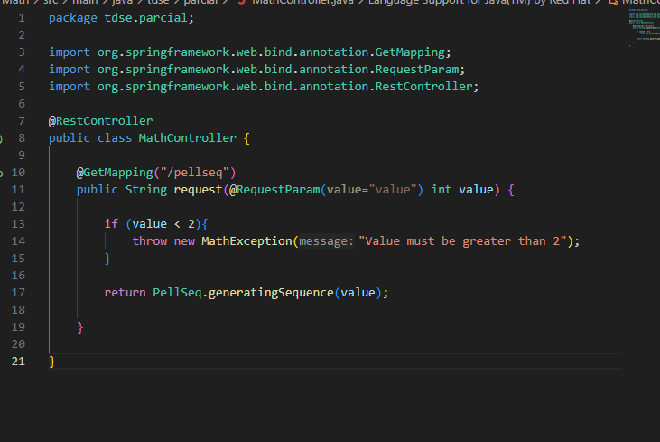

- Excepción:

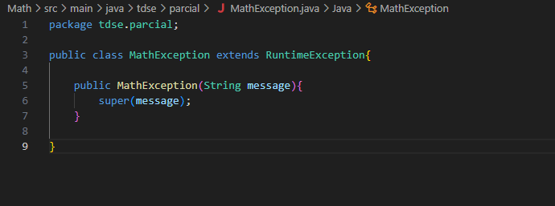

- Logica:

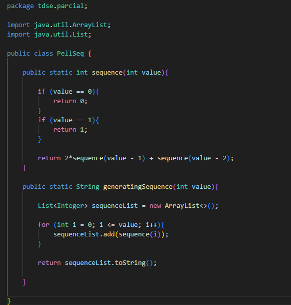

Prueba local Math Service

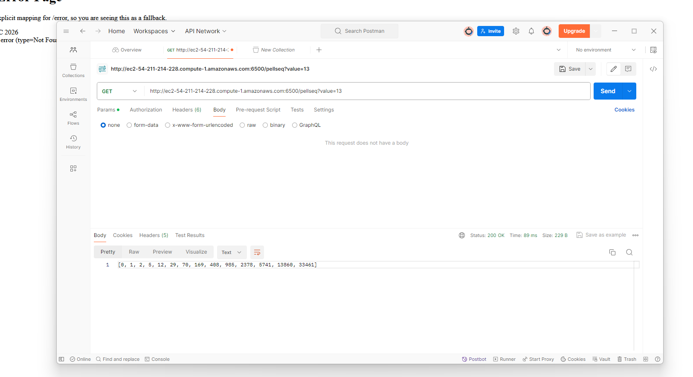

## Service Proxy

Este servicio desplegado también en una EC2 se va a encargar de redirigir a la instancia de MathService que se encuentre activa, de igual forma funciona como una Api que va a redirigir y se va a apoyar de una conexión http que se abrá hacía cada una de las instancias.

- Controlador:

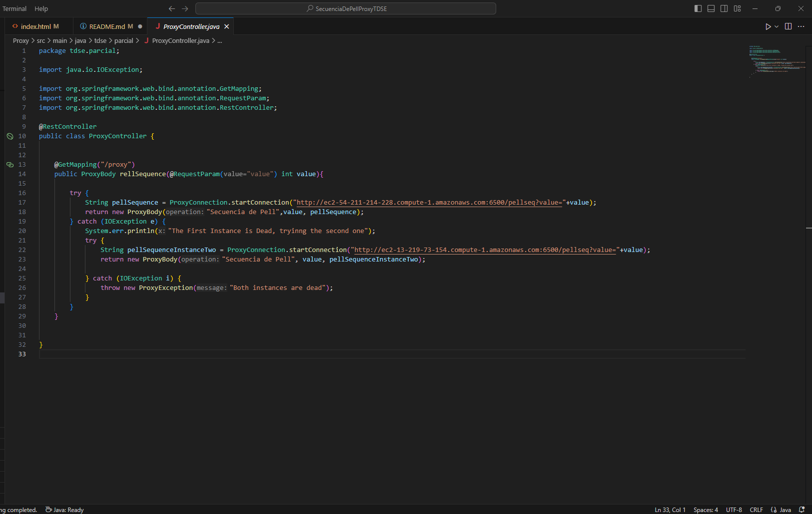

- ProxyConnection:

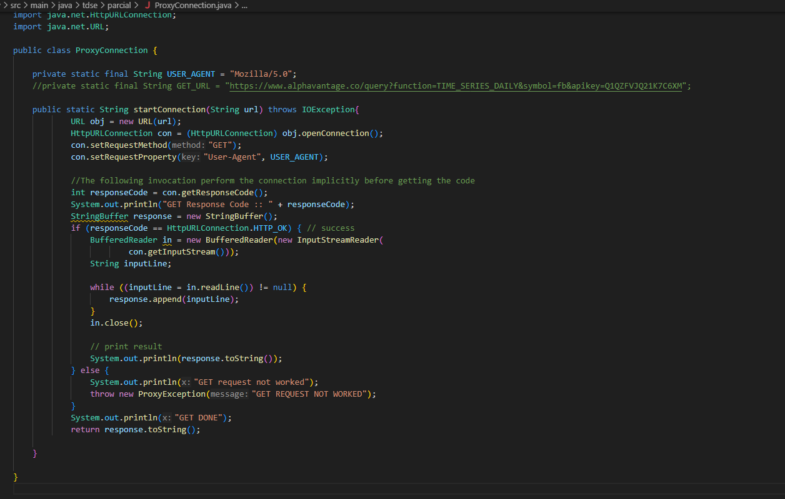

Devolvemos un proxyBody en el controlador, ya que es lo que se nos pide en el enunciado

Prueba local Proxy redirigiendo a instancia de MathService

En este service, vamos a desarrollar la interfaz gráfica que el usuario va a ver al ingresar al browser.

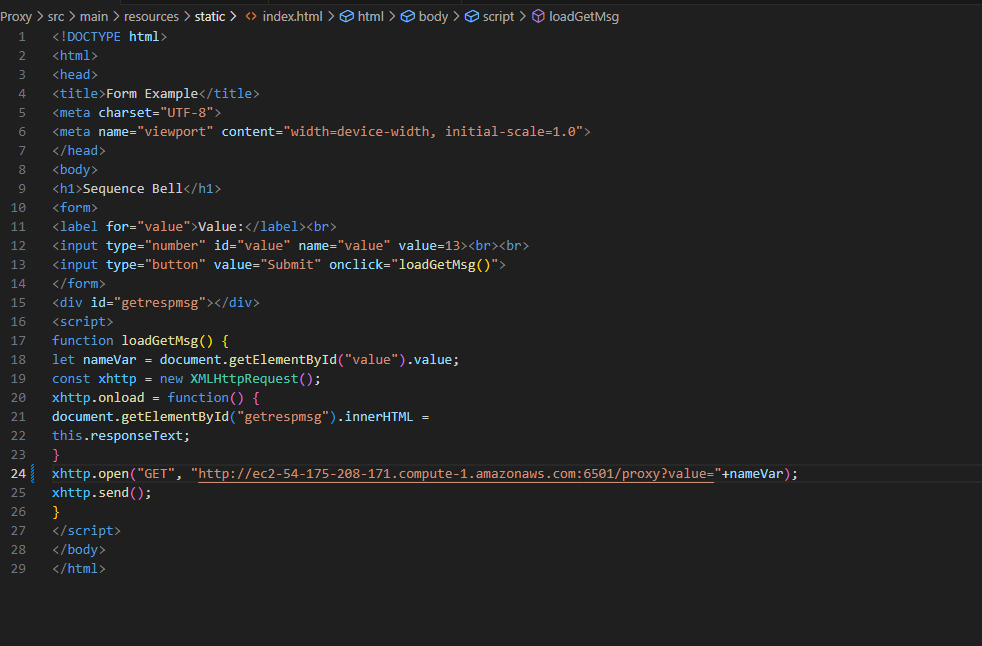

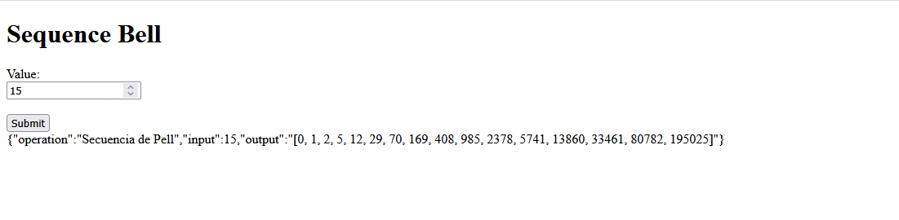

## Instancias (Despliegue en AWS)

Creando instancias en AWS

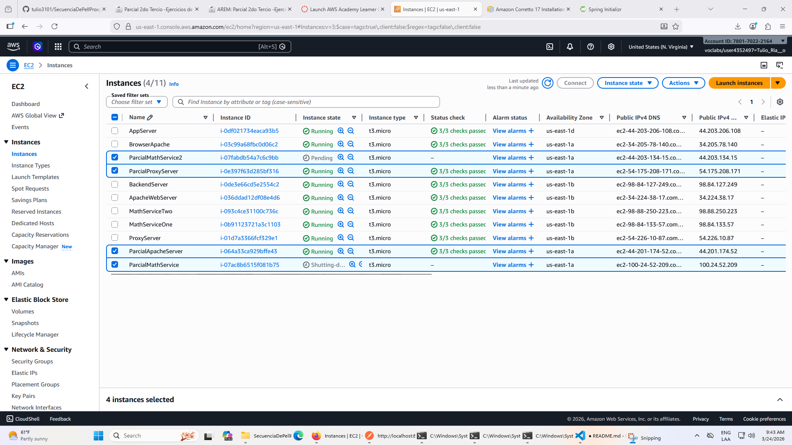

Instalando en EC2 java 17

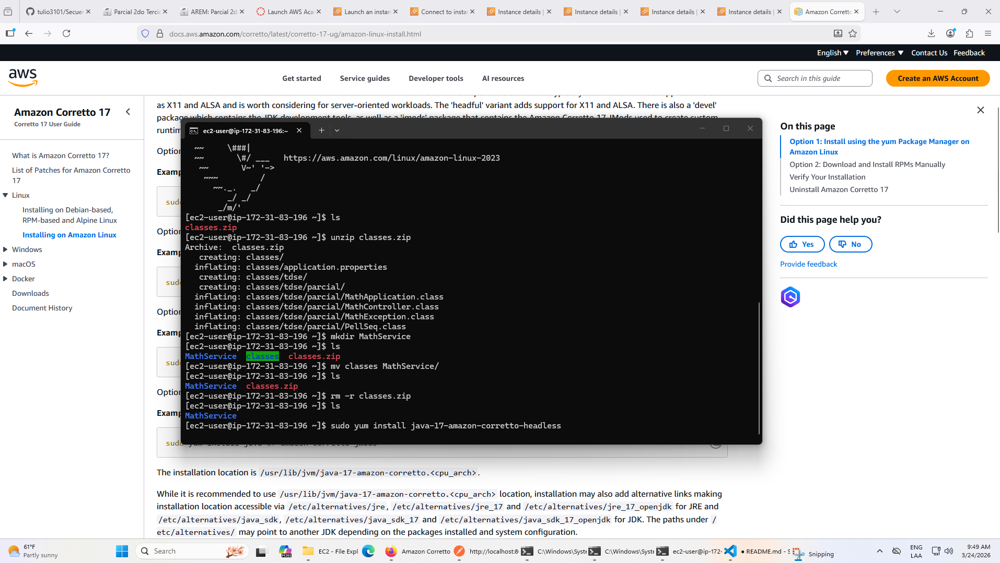

Pasando .class de MathService a EC2

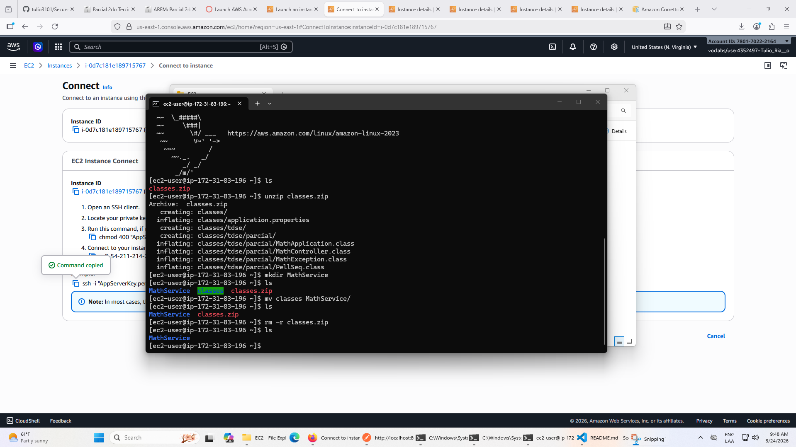

Desplegue funcional en Ec2 de PellSeq

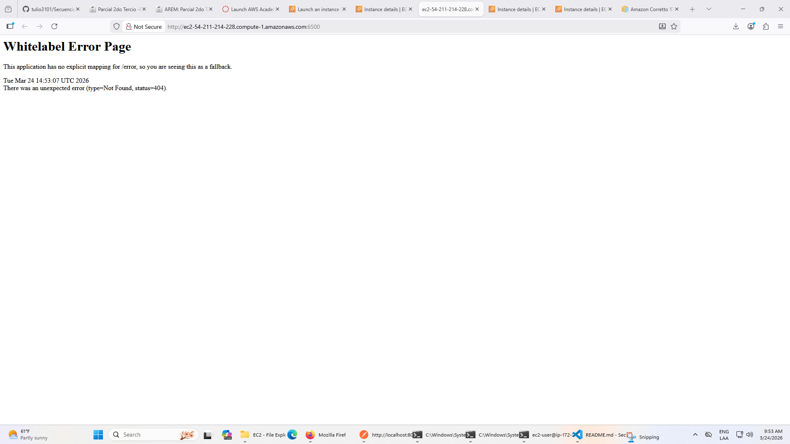

Despliegue funcional de la segunda Ec2 de PellSeq

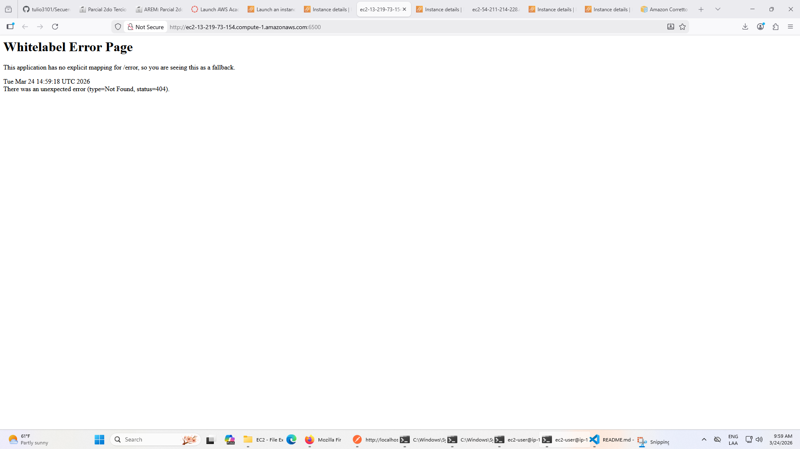

Probando desde Postman la peticion directamente hacia la instancia

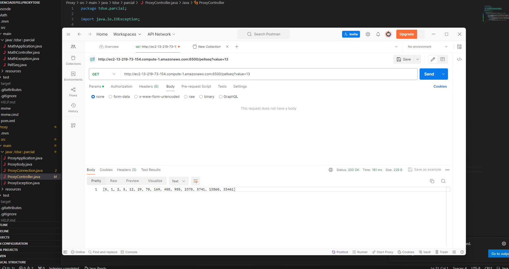

## Proxy Server

Despliegue del proxy server en una instancia de EC2 y prueba desde postamn

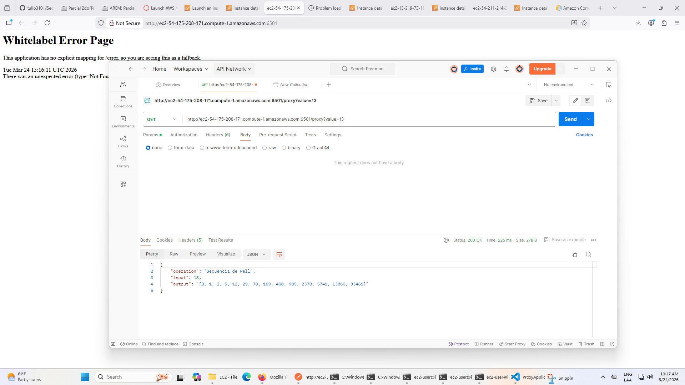

Despliegue Exitoso en EC2 del proxy server:

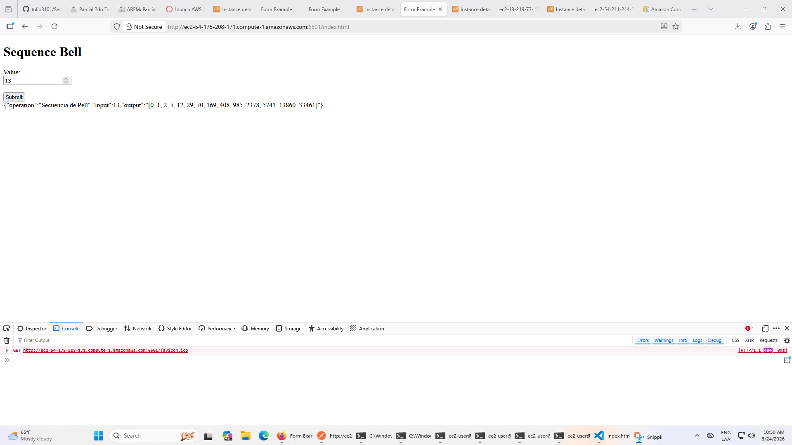

